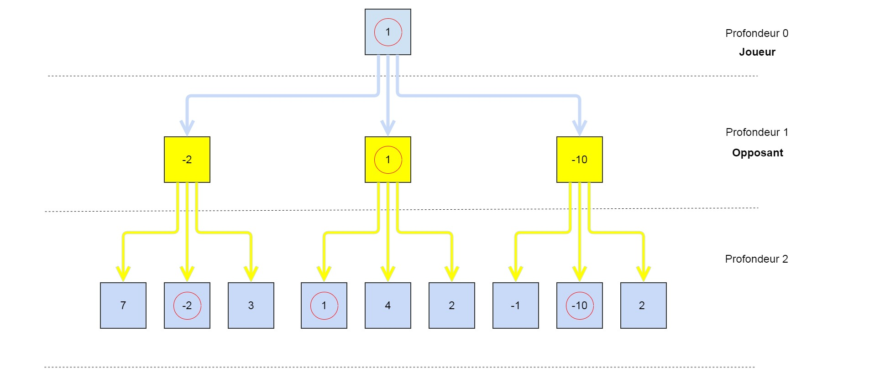

# L'algorithme Minimax

L'algorithme Minimax est un algorithme utilisé pour établir une stratégie de jeu. Il s'applique dans les jeux à somme nulle, opposant deux joueurs et où toutes les informations du plateau sont visibles. On parle de jeu à somme nulle lorsqu'en cours de partie, un gain pour un joueur constitue nécessairement une perte pour l'autre. La somme des gains des deux joueurs est donc nulle.

## Principe

L'algorithme repose sur le principe suivant : minimiser ses pertes en supposant que l'adversaire veuille maximiser ses gains.

La fonction Minimax est une fonction récursive utilisant trois sous-fonctions : la fonction Min, la fonction Max et la fonction Evalutation.

* La fonction Min retourne à partir d'un arbre de coups possibles le noeud ou les pertes seront les plus faibles.

* La fonction Max retourne à partir d'un arbre de coups possibles le noeud ou les gains seront les plus élevés;

* La fonction Evaluation retourne un nombre dont la valeur correspond à la position du jeu. Le nombre sera élevé si le jeu est favorable au joueur, il sera plus faible sinon.

## Modelisation 

Minimax construit un arbre contenant tous les coups possibles pour un tour. On appelle la profondeur le nombre de niveaux de l'arbre obtenu. PLus la profondeur est grande, plus l'algorithme est efficace. 
Minimax appelle ensuite Min si il s'agit d'un coup du joueur, ou Max si il s'agit d'un coup de l'adversaire. Min et Max vont ensuite s'apeller mutuellement jusqu'à atteindre les feuilles de l'arbre.

Sur le schéma suivant, les flèches bleues correspondent aux coups possibles du joueur, les flèches jaunes à ceux de l'opposant. L'algorithme est de profondeur 2 et on considère que trois coups sont possibles pour chaque configuration de jeu.

L'algorithme va parcourir l'arbre et utiliser la procédure d'évaluation pour associer à chaque feuille une valeur numérique. On se place ensuite sur les noeuds de profondeur 1 qui prendra la valeur du plus petit de ses fils : on minimise. On remonte ensuite d'un niveau et on prend ce coup ci la valeur du plus grand des fils : on maximise. 

On en déduit la série de coup la plus judicieuse à jouer : celle qui mène à la feuille qui est remontée au niveau 0.

* p est le noeud d'un arbre, il possède n fils (f1, f2, ..., fn).

* minimax(p) = eval(p) si p est une feuille
* minimax(p) = max(minimax(f1), minimax(f2), ... minimax(fn)) si il s'agit d'un coup du joueur
* minimax(p) = mim(minimax(f1), minimax(f2), ... minimax(fn)) si il s'agit d'un coup de son opposant

## Le Minimax associé aux échecs

Le nombre de coup possible aux échecs pour un tour est élevé. Pour une ouverture par exemple, au moins 20 coups différents sont possibles alors que plusieurs pièces n'ont pas la possibilité de bouger. Ainsi pour simuler les differentes possibilités sur les deux premiers tours on doit evaluer prés de 400 coups et pour une profondeur de 3 : 8000 coups. L'efficacité d'une IA Minimax est basée sur la profondeur de l'arbre des coups. Par conséquent, notre algorithme devra travailler sur un arbre relativement important et sera donc probablement coûteux en ressources.
Il nous faut donc optimiser l'implementation de notre algorithme Minimax c'est pour cela que nous utiliserons l'elagage alpha-beta et une table de transposition.

## L'evaluation d'un plateau de jeu

la principale difficulté de l'algorithme minimax ainsi que son efficacité repose sur la fonction d'evaluation, qui pour le jeux d'echecs vas à partir de la configuration d'un échequier produire une valeur numerique representant la pertinence de cette configuration. par exemple lorsque le joueur adversaire est en echec l'evaluation de cette configuration vas produire un trés grand nombre pour signaler que cette position est favorable au joueur.

Nous allons donc basé l'evaluation d'un échequier sur differentes données :

* Le nombre et le type de piéce present sur l'echequier :

    - Il faudrait donc attribuer a chaque piéce une valeur en fonction du type de piéce et si lorsque la piéce est retirer du jeux, enlever cette valeur au score du plateau si la piéce appartient au joueur ou sinon l'ajouter si la piéce appartenait au joueur adverse.  

* Comparer la configuration actuelle a des ouvertures connues :
    
    - Nous disposons d'une base de données d'ouverture ou chaque connfiguration est représenté par un hash contenant la position et le type de toutes les piéces presente sur l'echequier, l'ensemble de ces hash serait donc placé dans une table de hashage et la fonction d'evaluation pourait donc ce reféré a cette base de donnnées en comparant le hash du jeu actuel avec celui de cette base de données d'ouverture.

* Prendre en compte les situations d'echecs et de pat

    - L'evaluation doit absolument prendre en comptes les situations d'echecs, pat et mat notamement car l'echecs va bloquer la plupart des possibilité de jeu de l'adversaire car il est obligé de se sortir de cette situation mais plus encore c'est une conndition neccesaire à l'echecs et mat qui constitue le seul moyen de remporter la partie. 

## Optimisation du Min-Max

### Le NégaMax

Le principe du Negamax est relativement simple. Lorsque dans l'algorithme min-max nous testons si nous sommes sur un noeud à niveau pair ou impair, dans le but de maximiser ou de minimiser une évaluation, le Négamax va toujours chercher à maximiser l'évaluation. Il suffit d'inverser le signe des évaluations à chaque niveau, de ce fait, notre algorithme va toujours chercher à maximiser une évaluation.

Ce principe est assez intérresant, car il nous permet d'alléger l'algorithme min-max, en évitant certaines comparaisons.

### L'élagage Alpha-Beta

L'algorithme Alpha-Beta est une amélioration de l'algorithme min-max. Le but de cet algorithme est d'éviter le parcours de branches inutiles dans l'arbre des coups possibles. 
Comme son noms l'indique, l'algorithme alpha-beta utilise deux paramètres qui sont :
    
- alpha;
- beta.

La coupure alpha se fait sur les niveaux Min. Le principe de cette coupure va être qui si la valeur d'un niveau Min est plus petite que la valeur d'un niveau Max supérieur, nous considérons que la valeur du noeud Max supérieur ne changera pas, de ce fait, il est inutile d'aller explorer les branches suivantes du niveau Min.

D'un autre côté, nous avons la coupure béta, cependant, cette coupure s'effectue sur les niveaux Max. Le principe de la coupure béta est le même que pour la coupure alpha, mais pour les niveaux Max.

Nous avons donc deux coupures qui nous permettent d'éviter des parcours inutiles dans l'arbre des coups possibles, ce qui est un gain de temps.

### Comment utiliser les variables alpha et béta ?

Tout d'abord, nous devons savoir qu'il y a deux règles : 

- sur un niveau max, si la valeur du noeud >= béta, nous effectuons une coupure béta (1);
- sur un niveau min, si la valeur du noeud <= alpha, nous effectuons une coupure alpha (2).

C'est grâce à ces comparaisons quer nous pouvons effectuer un élagage, alpha ou béta. 

Les variables alpha et béta sont mis à jours lorsque un noeud retourne une évaluation. Sur un niveau Min, la valeur béta va être mis à jour, puis sur un noeud max, la valeur alpha va être mis à jour. 

Toutes les valeurs alpha et béta vont remonter aux niveaux supérieurs, et c'est à ce moment là que nous pourrons effectuer des tests avec les règles (1) et (2), et donc procéder à des coupures si besoin. Il faut savoir que les valeurs alpha et béta hérite des niveaux supérieurs.
